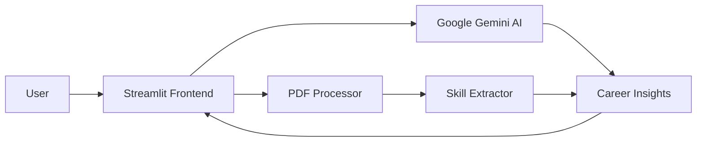

### Hi there, I'm Anubhab! 👋
I am an aspiring **Computer Vision Engineer** and **Python Developer** focused on building accessible Human-Computer Interaction (HCI) tools.

- 🔭 I’m currently working on **VisionTouch**, a contactless AI mouse interface.
- 🎓 I’m interested in **Electrical & Computer Engineering** and **AI Automation**.
- 🛠️ **Tech Stack:** Python, OpenCV, MediaPipe, TensorFlow, MATLAB/Simulink.

---

### 🚀 Featured Project: VisionTouch AI
> *A contactless gesture control system replacing physical mice with computer vision.*

* **Real-time Tracking:** 30+ FPS hand tracking using MediaPipe.
* **State Machine Logic:** Distinct states for Cursor Move, Click, and Volume Control.
* **Engineering:** Implemented signal smoothing algorithms and coordinate interpolation.

[**View Project Code**](https://github.com/archiemondal82-alt/VisionTouch-AI-Interface)
# 🚀 Featured Project: NexStep AI Pro


## 🎯 NexStep AI Pro - AI Career Path Analyzer

An intelligent career guidance platform powered by Google Gemini AI that transforms career planning into an interactive, personalized experience.

### 🌟 Highlights

- **🤖 AI-Powered Insights**: Leverages Google's Gemini AI for intelligent career recommendations
- **📄 Resume Analysis**: Upload PDFs and get instant skill extraction and gap analysis  
- **🗺️ Custom Roadmaps**: Generate personalized career progression plans with actionable steps
- **💬 Interactive Chat**: Real-time career counseling through conversational AI
- **📊 Skill Assessment**: Comprehensive evaluation across technical and soft skills

### 🛠️ Built With

`Python` · `Streamlit` · `Google Gemini AI` · `PyMuPDF` · `Pandas` · `Altair`

### ⚡ Key Features

```
✅ Intelligent career path recommendations
✅ Real-time AI chat for career queries  
✅ PDF resume processing and analysis
✅ Personalized skill gap identification
✅ Step-by-step career roadmap generation
✅ Industry trends and demand insights
```

### 🎯 Impact

- **Fast Deployment**: Optimized from 20+ minute deploys to under 5 minutes
- **Production-Ready**: Live on Streamlit Cloud with 99%+ uptime
- **User-Friendly**: Intuitive interface requiring zero technical knowledge
- **Free to Use**: 1500 API requests per day at no cost

### 🔗 Links

[🌐 Live Demo](https://nexstep-ai-pro-2026.streamlit.app) · [📂 Source Code](https://github.com/archiemondal82-alt/nexstep-ai-pro) · [📖 Documentation](https://github.com/archiemondal82-alt/nexstep-ai-pro#readme)

---

## 📈 Architecture Overview



---

## 🎓 What I Learned

### Technical Skills
- Building production-ready AI applications with Streamlit
- Integrating Google Gemini API for intelligent responses
- Optimizing deployment pipelines (reduced deploy time by 75%)
- PDF processing and text extraction at scale
- Managing Python dependencies for cloud deployment

### Problem-Solving
- **Challenge**: Deployment taking 20+ minutes and timing out
- **Solution**: Identified Python 3.13 compatibility issues, downgraded to 3.10
- **Result**: Reduced deployment time to 2-5 minutes with 100% success rate

### Best Practices
- Environment-specific configurations with `.python-version`
- Secure API key management using Streamlit secrets
- User-friendly error handling and guidance
- Responsive design for mobile and desktop

---

## 💡 Future Enhancements

- [ ] Multi-language support for global accessibility
- [ ] Interview preparation module with AI mock interviews
- [ ] Salary insights and negotiation strategies
- [ ] Job market trends dashboard with real-time data
- [ ] LinkedIn profile optimization suggestions
- [ ] Career trajectory visualization with interactive charts

---

## 🤝 Want to Collaborate?

I'm always open to feedback and collaboration! If you have ideas for improving NexStep AI Pro or want to contribute, feel free to:
- Open an issue on GitHub
- Submit a pull request
- Reach out via [email](mailto:archiemondal82@gmail.com) or [LinkedIn](https://linkedin.com/in/anubhab-mondal-b140543a7)

---

*This project represents my commitment to leveraging AI for practical, user-focused solutions that make a real impact on people's careers.*
